# 중앙 관리자 DB ERD 다이어그램

## 테이블 관계도 (Mermaid)

```mermaid
erDiagram
    central_admin ||--o{ audit_log : "performs"

    service ||--o{ plan : "offers"
    plan ||--o{ subscription : "subscribed as"

    tenant ||--o{ tenant_contact : "has"
    tenant ||--o| tenant_database : "has"
    tenant ||--o{ subscription : "subscribes"
    tenant ||--o{ provision_log : "provisioned"
    tenant ||--o{ usage_daily : "tracked"
    tenant ||--o{ notice : "receives"
    tenant ||--o{ inquiry : "submits"
    tenant ||--o{ partner_tenant : "managed by"
    tenant ||--o{ partner_access_request : "access requested"

    subscription ||--o{ payment : "paid by"

    partner ||--o{ partner_admin : "has staff"
    partner ||--o{ partner_tenant : "manages"
    partner ||--o{ partner_access_request : "requests access"
    partner_access_request ||--o{ partner_access_log : "logged"

    central_admin {
        int id PK
        varchar login_id "로그인ID"
        varchar password "비밀번호해시"
        varchar name "이름"
        varchar email "이메일"
        varchar phone "휴대폰"
        enum role "SUPER_ADMIN/ADMIN/OPERATOR/VIEWER"
        tinyint is_active "활성여부"
        datetime last_login_at "마지막로그인"
        datetime created_at
        datetime updated_at
    }

    tenant {
        int id PK
        varchar company_name "업체명"
        varchar business_number "사업자번호"
        varchar ceo_name "대표자명"
        varchar phone "대표전화"
        varchar email "대표이메일"
        varchar address "주소"
        enum status "PENDING/ACTIVE/SUSPENDED/TERMINATED"
        enum service_type "POSTURE/FOOT/BOTH"
        date contract_start "계약시작일"
        date contract_end "계약종료일"
        text memo "비고"
        datetime created_at
        datetime updated_at
    }

    tenant_contact {
        int id PK
        int tenant_id FK
        varchar name "담당자명"
        varchar phone "전화번호"
        varchar email "이메일"
        enum role "OWNER/MANAGER/TECH/BILLING"
        tinyint is_primary "주담당여부"
        datetime created_at
    }

    tenant_database {
        int id PK
        int tenant_id FK
        varchar db_host "DB호스트"
        int db_port "DB포트"
        varchar db_name "DB명"
        varchar db_user "DB계정"
        varchar db_password_enc "DB비밀번호암호화"
        varchar domain "서비스도메인"
        varchar db_version "스키마버전"
        enum status "PENDING/ACTIVE/MAINTENANCE/DECOMMISSIONED"
        datetime provisioned_at "배포일시"
        datetime last_migration_at "마지막마이그레이션"
        datetime created_at
        datetime updated_at
    }

    service {
        int id PK
        varchar code "서비스코드"
        varchar name "서비스명"
        text description "설명"
        tinyint is_active "활성여부"
        datetime created_at
    }

    plan {
        int id PK
        int service_id FK
        varchar name "요금제명"
        decimal monthly_price "월요금"
        decimal yearly_price "연요금"
        int max_members "최대회원수"
        int max_analyses "최대분석횟수_월"
        tinyint is_active "활성여부"
        datetime created_at
        datetime updated_at
    }

    subscription {
        int id PK
        int tenant_id FK
        int plan_id FK
        enum status "TRIAL/ACTIVE/EXPIRED/CANCELLED"
        enum billing_cycle "MONTHLY/YEARLY"
        date start_date "시작일"
        date end_date "종료일"
        date next_billing_date "다음결제일"
        datetime created_at
        datetime updated_at
    }

    payment {
        int id PK
        int subscription_id FK
        int tenant_id FK
        decimal amount "결제금액"
        decimal tax_amount "부가세"
        decimal total_amount "총액"
        enum method "CARD/TRANSFER/BILL"
        enum status "PENDING/COMPLETED/FAILED/REFUNDED"
        varchar transaction_id "PG거래번호"
        varchar invoice_number "세금계산서번호"
        date billing_period_start "과금시작일"
        date billing_period_end "과금종료일"
        datetime paid_at "결제일시"
        datetime created_at
    }

    provision_log {
        int id PK
        int tenant_id FK
        int admin_id FK
        enum action "CREATE/MIGRATE/BACKUP/RESTORE/DELETE"
        enum status "REQUESTED/IN_PROGRESS/COMPLETED/FAILED"
        varchar from_version "이전버전"
        varchar to_version "대상버전"
        text detail "상세내용"
        text error_message "오류메시지"
        datetime started_at "시작일시"
        datetime completed_at "완료일시"
        datetime created_at
    }

    usage_daily {
        int id PK
        int tenant_id FK
        date usage_date "집계일"
        int member_count "회원수"
        int posture_count "자세분석횟수"
        int foot_count "족부분석횟수"
        int notification_count "알림발송횟수"
        bigint storage_bytes "저장용량bytes"
        datetime collected_at "수집일시"
    }

    audit_log {
        int id PK
        int admin_id FK
        int tenant_id FK
        enum action "CREATE/UPDATE/DELETE/LOGIN/PROVISION/CONFIG"
        varchar target_type "대상테이블"
        varchar target_id "대상PK"
        text before_data "변경전JSON"
        text after_data "변경후JSON"
        varchar ip_address "접속IP"
        datetime created_at
    }

    notice {
        int id PK
        int admin_id FK
        int tenant_id FK
        enum target_type "ALL/SPECIFIC"
        varchar title "제목"
        text content "내용"
        tinyint is_published "게시여부"
        datetime published_at "게시일시"
        datetime created_at
        datetime updated_at
    }

    inquiry {
        int id PK
        int tenant_id FK
        int assigned_admin_id FK
        varchar subject "제목"
        text content "내용"
        enum category "BUG/FEATURE/BILLING/GENERAL"
        enum priority "LOW/MEDIUM/HIGH/URGENT"
        enum status "OPEN/IN_PROGRESS/RESOLVED/CLOSED"
        text reply "답변"
        datetime replied_at "답변일시"
        datetime resolved_at "해결일시"
        datetime created_at
        datetime updated_at
    }

    partner {
        int id PK
        varchar company_name "업체명"
        varchar business_number "사업자번호"
        varchar ceo_name "대표자"
        varchar phone "전화번호"
        varchar email "이메일"
        enum service_type "POSTURE/FOOT/BOTH"
        enum status "PENDING/ACTIVE/SUSPENDED/TERMINATED"
        date contract_start "계약시작일"
        date contract_end "계약종료일"
        datetime created_at
        datetime updated_at
    }

    partner_admin {
        int id PK
        int partner_id FK
        varchar login_id "로그인ID"
        varchar password "비밀번호해시"
        varchar name "이름"
        varchar email "이메일"
        enum role "PARTNER_ADMIN/STAFF/VIEWER"
        tinyint is_active "활성여부"
        datetime last_login_at
        datetime created_at
    }

    partner_tenant {
        int id PK
        int partner_id FK
        int tenant_id FK
        datetime created_at "연결일시"
    }

    partner_access_request {
        int id PK
        int partner_id FK
        int requested_tenant_id FK
        int requester_admin_id FK
        text reason "요청사유"
        enum access_scope "FULL/REPORT_ONLY/STATS_ONLY"
        enum status "PENDING/APPROVED/REJECTED/EXPIRED/REVOKED"
        int approved_by FK
        varchar reject_reason "거절사유"
        datetime access_start "허용시작"
        datetime access_end "허용종료"
        datetime processed_at "처리일시"
        datetime created_at
    }

    partner_access_log {
        bigint id PK
        int access_request_id FK
        int partner_admin_id FK
        int tenant_id FK
        varchar action "행위"
        varchar target_type "조회대상"
        varchar target_id "대상PK"
        varchar ip_address "접속IP"
        datetime created_at
    }
```

## 테이블 요약

| # | 영역 | 테이블 | 설명 |
|---|---|---|---|
| 1 | 관리자 | `central_admin` | 본사 중앙 관리자 계정 (RBAC) |
| 2 | 테넌트 | `tenant` | 가맹점 마스터 (라이프사이클 관리) |
| 3 | 테넌트 | `tenant_contact` | 가맹점 담당자 연락처 (복수) |
| 4 | 테넌트 | `tenant_database` | 가맹점 DB 인스턴스 접속/상태 정보 |
| 5 | 서비스 | `service` | 제공 서비스 마스터 (자세분석, 족부분석) |
| 6 | 서비스 | `plan` | 요금제 정의 (서비스별) |
| 7 | 구독 | `subscription` | 가맹점 구독 현황 |
| 8 | 구독 | `payment` | 결제 이력 |
| 9 | 운영 | `provision_log` | DB 프로비저닝/마이그레이션 이력 |
| 10 | 운영 | `usage_daily` | 일별 사용량 집계 |
| 11 | 감사 | `audit_log` | 관리자 행위 감사 로그 |
| 12 | CS | `notice` | 공지사항 |
| 13 | CS | `inquiry` | 가맹점 문의/요청 |
| 14 | 협력업체 | `partner` | 협력업체 마스터 |
| 15 | 협력업체 | `partner_admin` | 협력업체 관리자 계정 (RBAC) |
| 16 | 협력업체 | `partner_tenant` | 협력업체 ↔ 가맹점 소속 연결 |
| 17 | 협력업체 | `partner_access_request` | 타 가맹점 열람 요청/승인 |
| 18 | 협력업체 | `partner_access_log` | 승인된 열람 접근 이력 |
