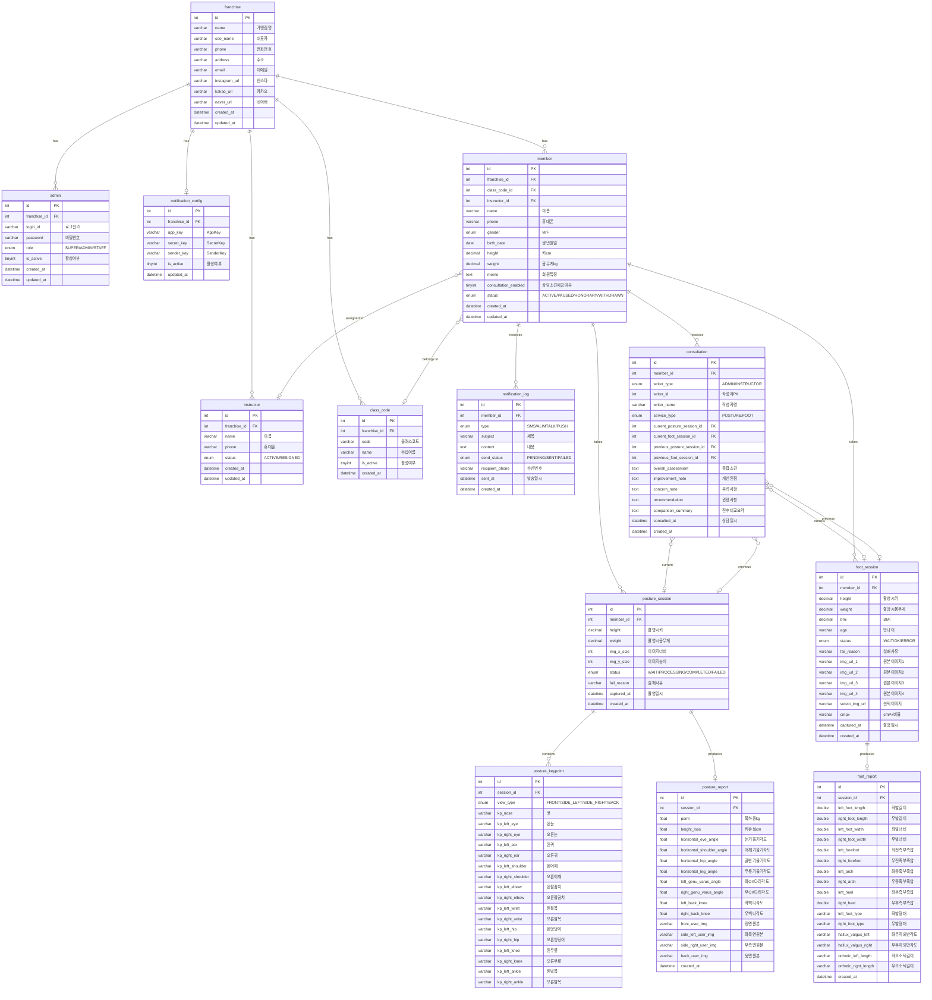

# 통합 앱 DB ERD 다이어그램

## 테이블 관계도 (Mermaid)

## 테이블 요약

| # | 테이블 | 설명 | 예상 데이터량 |
|---|---|---|---|
| 1 | `franchise` | 가맹점(업체) 정보 | 1건 (DB 복사 배포) |
| 2 | `admin` | 관리자 계정 | 소수 |
| 3 | `instructor` | 강사 정보 | 소수 |
| 4 | `class_code` | 수강반 코드 | ~16건 |
| 5 | `member` | 회원 정보 | 가맹점별 상이 |
| 6 | `posture_session` | AI자세분석 촬영 세션 | 회원 x 촬영횟수 |
| 7 | `posture_keypoint` | 자세분석 키포인트 좌표 | 세션 x 4방향 |
| 8 | `posture_report` | 자세분석 리포트 결과 | 세션당 1건 |
| 9 | `foot_session` | AIoT족부분석 촬영 세션 | 회원 x 촬영횟수 |
| 10 | `foot_report` | 족부분석 리포트 결과 | 세션당 1건 |
| 11 | `notification_config` | 알림톡 설정 | 1건 |
| 12 | `notification_log` | 알림 발송 이력 | 누적 |
| 13 | `consultation` | 상담 소견 (전/후 비교) | 선택적 회원 x 상담횟수 |
